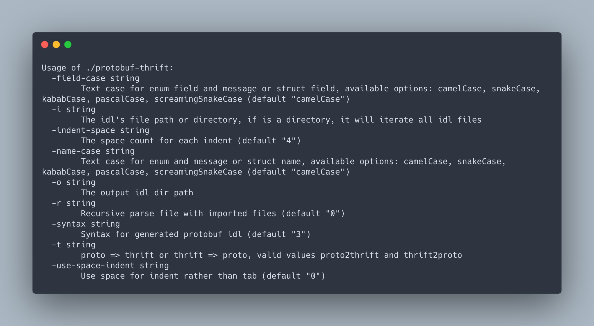

# protobuf-thrift
为懒人准备的 protobuf 与 thrift 互转的小工具😉。

[](https://app.circleci.com/pipelines/github/YYCoder/protobuf-thrift)
[](https://pkg.go.dev/github.com/YYCoder/protobuf-thrift)
[](https://goreportcard.com/report/github.com/yycoder/protobuf-thrift)
[](http://makeapullrequest.com)

> [IDL](https://en.wikipedia.org/wiki/IDL)(Interface description language)。是指一种用于定义数据类型以及接口的描述性语言，与编程语言以及平台无关，常用在微服务架构中。

欢迎试用我们的 [web 界面](https://pb-thrift.markeyyuan.monster/)，更简单直观地进行转换，以及，如下是两者的语言规范，如果有任何问题，欢迎提 issue 或 PR。

* [thrift](https://thrift.apache.org/docs/idl.html)

* [protobuf](https://developers.google.com/protocol-buffers/docs/reference/proto3-spec)

## 安装
如果没有 go 开发环境，可以直接从 release 中下载最新版的对应平台的二进制文件。

对于 Gophers，可以直接使用 `go install github.com/YYCoder/protobuf-thrift`。

## 使用示例

### 基本用法
将 thrift 文件转成 protobuf 文件：

```
protobuf-thrift -t thrift2proto -i ./path/to/idl.thrift -o ./idl.proto
```

将 protobuf 文件转成 thrift 文件：

```
protobuf-thrift -t proto2thrift -i ./path/to/idl.thrift -o ./test.proto
```

### 交互式用法
直接使用 `protobuf-thrift -t thrift2proto` 命令会进入交互模式，直接粘贴你的源 idl 源码到终端，并按下 ctrl+D 即可。


### 大小写转换
得益于 [strcase](https://github.com/iancoleman/strcase)，Protobuf-thrift 提供了完整的变量大小写转换能力，可用的选项已经在 **--help** 提示信息中了，请自行查阅。

### 递归转换
某些场景下，我们可能需要将整个 idl 仓库转成另一种语言，此时我们就可以使用 **-r** 选项来递归地将 import 的文件全部转换。

该选项默认是禁用的，要使用它时需要显式指定。


```
protobuf-thrift -t thrift2proto -i ./path/to/idl.thrift -o ./idl.proto -r 1
```


## 可用选项



## 注意事项
由于 protobuf 与 thrift 有很多语法上的不同，我们不可能完全将一种 idl 转换成另一种，protobuf-thrift 也只是一个帮助我们摆脱复制粘贴的小工具，它所提供的功能能够满足 80% 的场景就足够了。因此，我们只会尽可能将有相同语义的语法进行转换，如 protobuf message => thrift struct，protobuf enum => thrift enum。

为了确保你能够明确的知道 protobuf-thrift 会如何转换，我们**强烈建议你阅读下方的文档**，从而明确了解对于特定语法是如何做转换的。

### 基本类型
如下是两种 idl 语言的基本类型转换规则：

|[protobuf type](https://developers.google.com/protocol-buffers/docs/proto3#scalar)|[thrift type](https://thrift.apache.org/docs/types.html#base-types)|
|:--:|:--:|
|uint32|-|
|uint64|-|
|sint32|-|
|sint64|-|
|fixed32|-|
|fixed64|-|
|sfixed32|-|
|sfixed64|-|
|-|i16|
|int32|i32|
|int64|i64|
|float|double|
|double|double|
|bool|bool|
|string|string|
|bytes|-|
|-|byte|

### Enum
Protobuf 和 thrift 都有 `enum` 声明，并且语法基本一致，只有如下一点需要注意：

> **Proto3 的 enum 声明中第一个元素必须值为 0，因此在 thrift 转换 pb 的过程中，源 thrift 枚举中不包括值为 0 的元素，则 protobuf-thrift 会自动添加。**

如下例：

```thrift
enum Status {
    StatusUnreviewed = 1 // first non-zero element
    StatusOnline = 2
    StatusRejected = 3
    StatusOffline = 4
}
```

会转换成：

```protobuf
enum Status {
    Status_Unknown = 0;
    Status_Unreviewed = 1; // first non-zero element
    Status_Online = 2;
    Status_Rejected = 3;
    Status_Offline = 4;
}
```

### Service
Protobuf 和 thrift 都有 `service` 作为顶级声明，但也有一些区别：

1. **oneway**: 只在 thrift 中支持，语义是该方法不会关心返回结果，在 thrift-to-pb 模式下该字段会被忽略

2. **throws**: 只在 thrift 中支持，语义是指定该函数可能抛出什么类型的异常，同上，在 thrift-to-pb 模式也会被忽略thrift-to-pb mode.

3. **函数参数**: 
    * thrift 函数支持多个参数，但 pb 的 `rpc` 函数只支持一个参数，因此 thrift-to-pb 模式转换时会忽略除第一个参数以外的所有参数

    * thrift 支持 `void` 返回类型，但 pb 不支持，在 thrift-to-pb 模式下会对返回 `void` 的 thrift 函数生成的 `rpc` 函数返回结果置空
    
    * 目前函数参数和返回值都只支持基本类型和标识符，以后有需要可以在实现

### Options || Annotation
两种语言都支持这个特性，但由于这种语法是跟语言强绑定的，强行搬到另一个语言中很难符合语义，因此目前在转换中都会忽略。

### Message || Struct
Thrift `struct` 和 protobuf `message` 非常相似，但仍有些许不同:

1. **set type**: 只在 thrift 中支持，最终会被转成 protobuf 的 `repeated` 字段，thrift `list` 也一样

2. **optional**: thrift 和 proto2 支持，在 thrift-to-pb 模式下若选择的 `syntax` 是 proto3，则会忽略

3. **required**: thrift 和 proto2 支持，由于该字段标示为 required 在 pb 中是强烈不建议的，因此目前都会忽略，若有需求可以提 issue

4. **map type**: 正如 protobuf [语言规范](https://developers.google.com/protocol-buffers/docs/reference/proto3-spec#map_field) 中提到, protobuf 只支持基础类型作为 map 的 key，但 thrift 支持任意 [FieldType](https://thrift.apache.org/docs/idl.html)，为了简洁性考虑，目前对于 map 的 key 和 value 都只支持基本类型和标识符

### Import || Include
正如 [protobuf 语言规范](https://developers.google.com/protocol-buffers/docs/proto#importing_definitions) 中定义，protobuf `import` 路径是以 protoc 命令执行时的当前工作目录或 -I/--proto_path 指定的路径为基础路径的，并且也要求路径中不能包含相对路径前缀，如 `./XXX.proto`，因此我们无法在转换时得知正确的引用路径是什么。

因此，你需要在转换之后手动检查一下转换出来的路径是否正确，并自行修改。

### Constant || Const
目前还不支持转换，若有需求欢迎提 issue 或 PR。

### Package || Namespace
Thrift `namespace` 的 value 会被用作 `package` 的 value，但 NamespaceScope 在 thrift-to-pb 模式下会被忽略。

在 pb-to-thrift 模式下，生成的 `namespace` 会默认使用 `*` 作为 NamespaceScope。


### 嵌套字段
protobuf 支持在 message 结构体中嵌套字段（如 enum/message），但在 thrift 中不支持，因此 protobuf-thrift 会通过给嵌套字段的标识符使用外部 message 名称作为前缀的方式来实现相同命名空间的效果。如下例：

```protobuf
message GroupMsgTaskQueryExpress {
    enum QueryOp {
        Unknown = 0;
        GT = 1;
    }
    message TimeRange {
        int32 range_start = 1;
        int32 range_end = 2;
    }
    QueryOp express_op = 1;
    int32 op_int = 2;
    TimeRange time_op = 3;
    int32 next_op_int = 4;
}
```

会被转换成：

```thrift
struct GroupMsgTaskQueryExpress {
    1: GroupMsgTaskQueryExpressQueryOp ExpressOp
    2: i32 OpInt
    3: GroupMsgTaskQueryExpressTimeRange TimeOp
    4: i32 NextOpInt
}
enum GroupMsgTaskQueryExpressQueryOp {
    Unknown = 0
    GT = 1
}
struct GroupMsgTaskQueryExpressTimeRange {
    1: i32 RangeStart
    2: i32 RangeEnd
}
```


